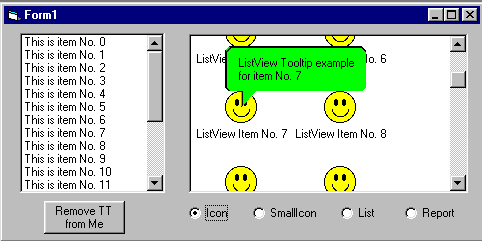



## Custom ToolTips

### Description

Class for adding tooltips for any control with hwnd property. You can chose back and fore color for tooltips, style (standard or ballon), center it. Allow to add tooltips to every item in controls with items (listbox, listview, treeview). You can set delay and visible time of tooltip and its maximum width.
 
### More Info
 

             |
---                |---
**Submitted On**   |2000-07-30 15:00:50
**By**             |[Ark](https://github.com/Planet-Source-Code/PSCIndex/blob/master/ByAuthor/ark.md)
**Level**          |Advanced
**User Rating**    |4.9 (39 globes from 8 users)
**Compatibility**  |VB 5\.0, VB 6\.0
**Category**       |[Custom Controls/ Forms/  Menus](https://github.com/Planet-Source-Code/PSCIndex/blob/master/ByCategory/custom-controls-forms-menus__1-4.md)
**World**          |[Visual Basic](https://github.com/Planet-Source-Code/PSCIndex/blob/master/ByWorld/visual-basic.md)
**Archive File**   |[CODE\_UPLOAD93198262000\.zip](https://github.com/Planet-Source-Code/ark-custom-tooltips__1-9185/archive/master.zip)

